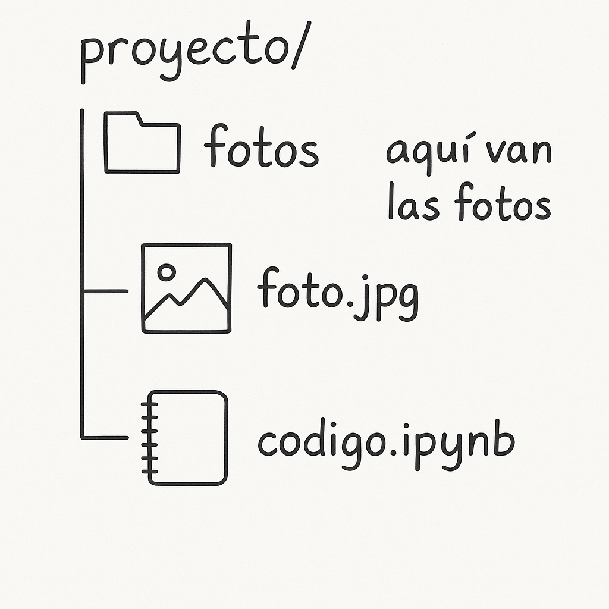

# Creación de Fotomosaicos usando IA vs sin IA

Este proyecto tiene como objetivo explorar la generación de **fotomosaicos** utilizando inteligencia artificial en comparación con métodos tradicionales. Se toma una imagen objetivo (`foto.jpg`) y se reconstruye usando muchas imágenes pequeñas (tiles) ubicadas en la carpeta `fotos/`.

## Estructura del Proyecto

El proyecto se organiza de la siguiente manera:

proyecto/  
├── fotos/ # Aquí van las imágenes pequeñas (tiles)  
├── foto.jpg # Imagen objetivo a reconstruir  
└── codigo.ipynb # Notebook con el código principal  

A continuación, se presenta una representación visual de la estructura del proyecto:

## Instrucciones básicas

1. Coloca todas las imágenes pequeñas en la carpeta `fotos/`.
2. Guarda la imagen que quieres reconstruir como `foto.jpg` en la raíz del proyecto.
3. Ejecuta el código del notebook `codigo.ipynb` para generar el fotomosaico.

## Tecnologías usadas

- Python
- OpenCV / PIL
- NumPy
- IA (si se aplica, según método)

---